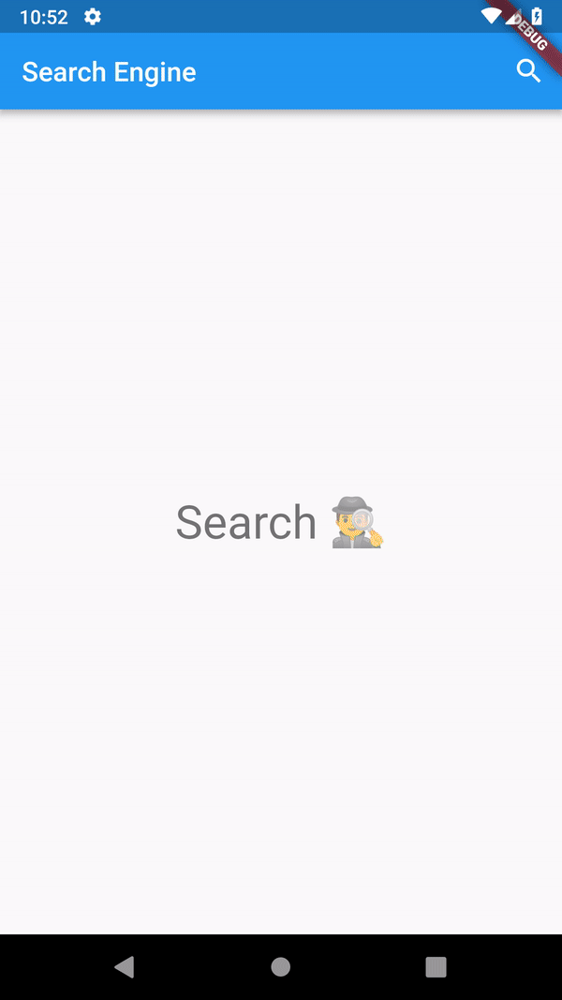

# searchengine

Search any query from Google custom search API. The app is built using BLoC pattern.



Screenshot for Search Engine

## Installation

- Get the `api_key` and `search_engine_id` from Google [custom-search](https://developers.google.com/custom-search/v1/overview).
- Create `secrets.json` file in the `assets/properties` folder.
- Add `api_key` and `search_engine_id` to `secrets.json` file like such:

```json
{
  "api_key": "YOUR_API_KEY",
  "search_engine_id": "YOUR_SEARCH_ENGINE_ID"
}
```

## Design Patterns

- Dependency Injection
- Reactive Programming
- BLoC Pattern
- In Memory Caching

## Packages

- cupertino_icons
- http
- flutter_webview_plugin
- rxdart

## Getting Started

This project is a starting point for a Flutter application.

A few resources to get you started if this is your first Flutter project:

- [Lab: Write your first Flutter app](https://flutter.io/docs/get-started/codelab)
- [Cookbook: Useful Flutter samples](https://flutter.io/docs/cookbook)

For help getting started with Flutter, view our 
[online documentation](https://flutter.io/docs), which offers tutorials, 
samples, guidance on mobile development, and a full API reference.
